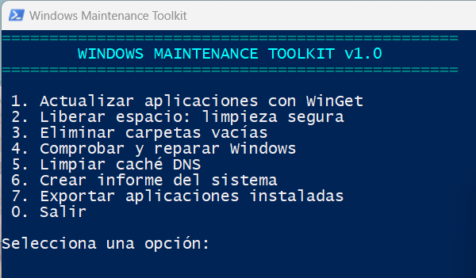

# Windows Maintenance Toolkit (WMT)

<h2>Captura de pantalla</h2>

<p align="center">
  
</p>

Herramienta modular de mantenimiento para Windows 10 y Windows 11, construida
con PowerShell 5.1 y un lanzador `.cmd`.

WMT busca reunir tareas habituales de mantenimiento en un menú único, legible
y relativamente seguro. No pretende sustituir las herramientas oficiales del
fabricante ni una copia de seguridad.

## Funciones de la versión 1.0

1. Actualizar aplicaciones compatibles mediante WinGet.
2. Liberar espacio con una limpieza segura.
3. Eliminar carpetas vacías.
4. Comprobar y reparar Windows mediante DISM y SFC.
5. Limpiar la caché DNS.
6. Crear un informe básico del sistema.
7. Exportar las aplicaciones reconocidas por WinGet.
8. Guardar registros de cada ejecución.

## Requisitos

- Windows 10 o Windows 11.
- PowerShell 5.1 o posterior.
- Permisos de administrador.
- WinGet para actualizar o exportar aplicaciones.

## Uso

1. Descarga o clona el repositorio.
2. Mantén intacta la estructura de carpetas.
3. Ejecuta `Start-WMT.cmd`.
4. Acepta la solicitud de permisos de administrador.
5. Selecciona una opción del menú.

También puede iniciarse manualmente:

```powershell
powershell.exe -NoProfile -ExecutionPolicy Bypass -File ".\src\WMT.ps1"
```

## Seguridad

La limpieza segura no borra de forma intencionada:

- Descargas.
- Documentos.
- Escritorio.
- Imágenes o vídeos personales.
- Puntos de restauración.
- El archivo de hibernación.
- Versiones base de componentes mediante `DISM /ResetBase`.

La eliminación de carpetas vacías:

- requiere escribir `ELIMINAR`;
- omite enlaces simbólicos, puntos de unión y otros reparse points;
- excluye rutas críticas configuradas;
- analiza por defecto todas las unidades internas fijas.

Aun así, cualquier script ejecutado como administrador tiene riesgo. Revisa el
código y mantén copias de seguridad de la información importante.

## Configuración

La configuración predeterminada está en:

```text
config/config.json
```

Para personalizarla sin modificar el archivo versionado, crea:

```text
config/config.local.json
```

Ese archivo está ignorado por Git.

### Analizar rutas concretas

Cambia:

```json
"Mode": "FixedDrives"
```

por:

```json
"Mode": "Custom",
"CustomRoots": [
  "D:\\Datos",
  "E:\\Proyectos"
]
```

## Estructura

```text
Windows-Maintenance-Toolkit/
├── Start-WMT.cmd
├── README.md
├── LICENSE
├── CHANGELOG.md
├── CONTRIBUTING.md
├── SECURITY.md
├── config/
│   └── config.json
├── docs/
│   └── ROADMAP.md
├── logs/
│   └── .gitkeep
└── src/
    ├── WMT.ps1
    └── modules/
        ├── Common.psm1
        ├── UpdateApps.psm1
        ├── Cleanup.psm1
        ├── EmptyFolders.psm1
        ├── Repair.psm1
        └── Reports.psm1
```

## Limitaciones

- `winget upgrade --all` actualiza aplicaciones compatibles; no garantiza
  actualizar todos los controladores.
- Algunos archivos temporales en uso no pueden eliminarse hasta reiniciar.
- La cifra de espacio recuperado es aproximada.
- El análisis recursivo de unidades grandes puede tardar bastante.
- Los informes pueden contener nombre del equipo, modelo y datos técnicos.
  La carpeta `logs` está excluida de Git para evitar subirlos accidentalmente.

## Licencia

MIT. Consulta [LICENSE](LICENSE).
